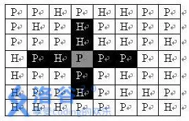
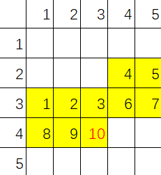

```metadata
title: 从状态压缩到轮廓线动态规划
date: 2026-03-16 11:00
category: 动态规划
difficulty: medium
```

## 轮廓线的思路

在接触轮廓线dp前，我们就发现有一些动态规划，我们第一时间容易设计一个**较差**的状态，再去尝试将**较差**的状态给优化成较好的状态，轮廓线动态规划也是对于传统状态压缩动态规划做一个这样的优化。

### 类似轮廓线动态规划的优化例题 

[摩天大楼里的奶牛](https://www.luogu.com.cn/problem/P3052)

一个鲜为人知的事实是，Bessie 和她的朋友们喜欢爬楼梯比赛。一个更为人知的事实是，奶牛们真的不喜欢下楼梯。因此，当奶牛们比赛到达她们最喜欢的摩天大楼的顶层后，她们遇到了一个问题。拒绝使用楼梯下楼，奶牛们被迫使用电梯返回地面层。

电梯的最大载重量为 $W$ 磅 $(1 \leq W \leq 100,000,000)$，奶牛 $i$ 的体重为 $C_i$ 磅 $(1 \leq C_i \leq W)$。请帮助 Bessie 找出如何用最少的电梯次数将所有 $N$ 头奶牛 $(1 \leq N \leq 18)$ 送到地面层。每次电梯的总重量不能超过 $W$。

对于这个问题容易给出动态转移方程：

$$ f_S = \min_{S' \subset S \And weight(S') < W} (f_{S/S'} + 1) $$

其中 $f_S$ 表示的是将集合$S$的奶牛运送完成所需的最小电梯次数。

如果这样做我们每次需要枚举 $S'$ 这个复杂度就达到了 $O(4^n)$,对于 $N = 18$ 的情况就超时了。

**进一步优化**
我们为了避免**枚举一个集合**，我们可以每次枚举集合添加的元素：

$$ f_{S,m} = \min_{a \in S} f_{S/a ,m - w_a} $$

$$ f_{S,0} = f_S + 1$$

其中 $f_{S,m}$ 表示的是将集合$S$的奶牛运送完成，最后一个电梯奶牛的重量和为$m$,所需的最小电梯次数。

这样就将非多项式复杂度的枚举时间复杂度变为了多项式复杂度的枚举，只不过此时状态数仍然很多，需要**用贪心的思路把第二个维度放到状态函数值中**（这是另外一种常见的动态规划状态优化思路）。

上面将非多项式复杂度的枚举时间复杂度变为了多项式复杂度的枚举的做法就是轮廓想动态规划优化的思路。

### 从熟悉的例题优化开始

[炮兵阵地](https://www.luogu.com.cn/problem/P2704)

司令部的将军们打算在 $N\times M$ 的网格地图上部署他们的炮兵部队。

一个 $N\times M$ 的地图由 $N$ 行 $M$ 列组成，地图的每一格可能是山地（用 $\texttt{H}$ 表示），也可能是平原（用 $\texttt{P}$ 表示），如下图。

在每一格平原地形上最多可以布置一支炮兵部队（山地上不能够部署炮兵部队）；一支炮兵部队在地图上的攻击范围如图中黑色区域所示：

 

如果在地图中的灰色所标识的平原上部署一支炮兵部队，则图中的黑色的网格表示它能够攻击到的区域：沿横向左右各两格，沿纵向上下各两格。

图上其它白色网格均攻击不到。从图上可见炮兵的攻击范围不受地形的影响。

现在，将军们规划如何部署炮兵部队，在防止误伤的前提下（保证任何两支炮兵部队之间不能互相攻击，即任何一支炮兵部队都不在其他支炮兵部队的攻击范围内），在整个地图区域内最多能够摆放多少我军的炮兵部队。

对于 $100\%$ 的数据，$1 \leq N\le 100$，$1 \leq M\le 10$，保证字符仅包含 `P` 与 `H`。

**传统的动态规划做法**

$$ f_{i, S_1,S_2} = \min_{available(S_1,S_2,S_3)} (f_{i-1, S_2,S_3} + count(S_1)) $$

其中 $f_{S_1,S_2}$ 表示第$i$行的炮兵集合为$S_1$,第$i - 1$行的炮兵集合为$S_2$的最多的炮兵数量, $available(S_1,S_2,S_3)$ 是表示检查集合的合法性， $count(S)$ 是计算集合中的`1`的个数。

正常这样做会超时超空间，但是我们会发现$S_1$和$S_2$有些状态不会涉及，可以使用`bfs`写法写避免无效状态，时间复杂度约为 $O(4.5^M * N) $

**轮廓线式的优化思路**

设计一个这样的状态 $f_{i,j,S}$ 表示目前已经考虑好前 $i-1$ 行的所有格子和第 $i$ 行的元素前 $j$ 个的格子是否防炮兵，最后两行（如下图所示）的状态为 $S$ ：



其中红色格子是表示第$i$行，第$j$列的格子,即$i=4$,$j=3$。$S$涉及到的格子是黄色标记的，其中的数字表示是在状压的数字的第几位。

$$ f_{i,j,S} = \min_{available(S.set(j,S[j+m]).set(j+m,0/1))} f_{i,j-1,S.set(j,S[j+m]).set(j+m,0/1)} + 0/1 $$

$ S.set(a,b) $ 表示将 $S$ 的第 $a$ 位变为 $b$

### 习题

[[COCI 2020/2021 #3] Selotejp](https://www.luogu.com.cn/problem/P7171)

[互不侵犯](https://www.luogu.com.cn/problem/P1896)

[[USACO06NOV] Corn Fields G](https://www.luogu.com.cn/problem/P1879)

[蒙德里安的梦想](https://www.luogu.com.cn/problem/P10975)
